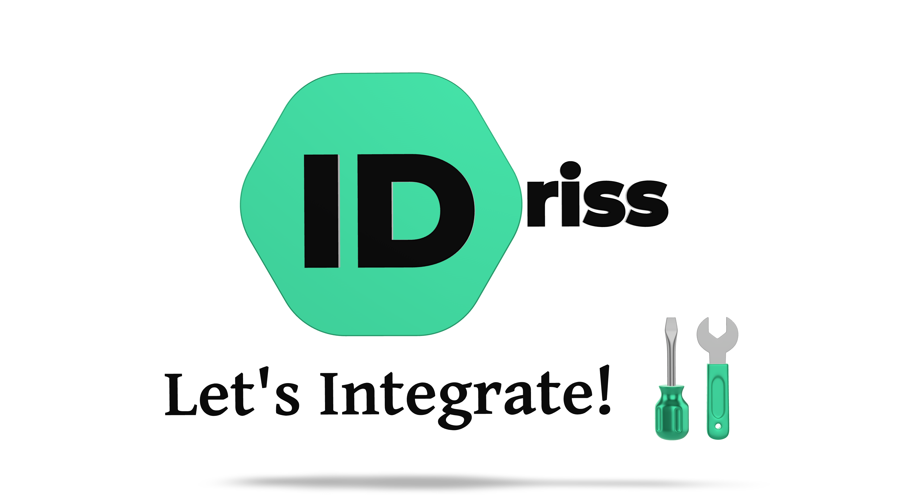
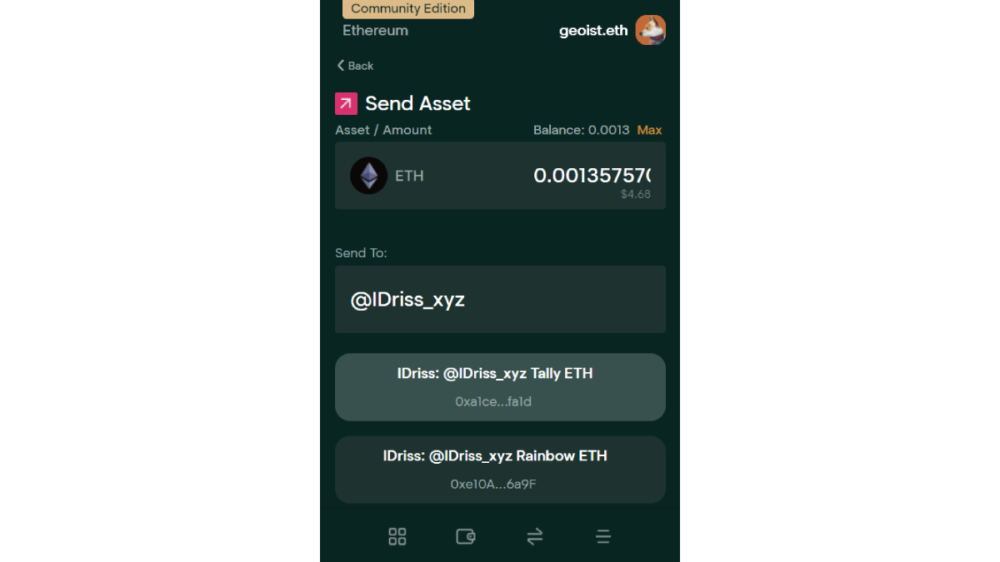
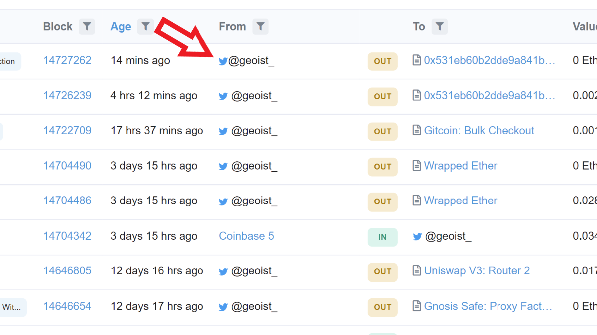
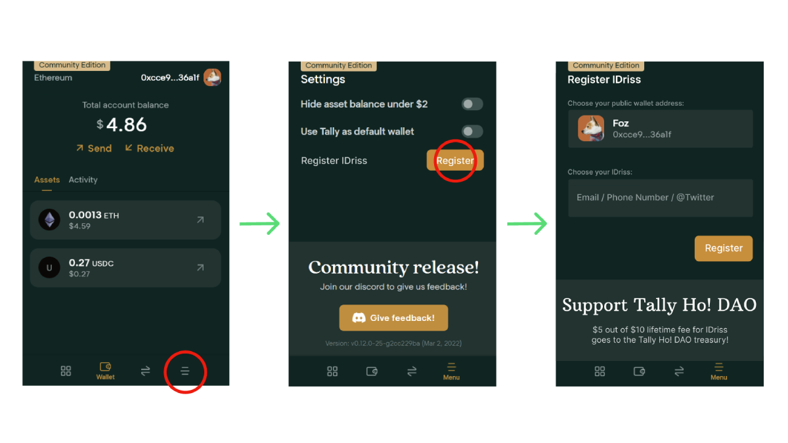

# Integrate IDriss Into Your Project

<p align="center">

</p>

This is a node.js and webpack library for integrating [IDriss](https://www.idriss.xyz/) into your project.

IDriss builds tools making web3 more usable for everyone 🤝

## Content

This library lets you integrate 4 independent functions from two products:

**IDriss Book** - decentralized mapping of emails, phone numbers and Twitter usernames to wallet addresses
1. [Resolving](#1-resolving)
2. [Reverse resolving](#2-reverse-resolving)
3. [Registering new records](#3-registering-new-records)

**IDriss Send** - mass web3 onboarding & asset distribution tool

4. [Sending crypto & NFTs to emails, phone numbers, and Twitter usernames](#4-sending-crypto--nfts-to-emails-phone-numbers-and-twitter-usernames)

## Benefits

- Improving UX by letting use familiar web2 identifiers in search bars and input fields
- Augmenting UI by replacing wallet addresses with human-readable names
- Linking Twitter usernames, emails, and phone numbers to user profiles in a decentralized manner
- Scaling your app beyond crypto-native userbase

## Cloning This Lib
```
git clone --recurse-submodules https://github.com/idriss-crypto/contracts.git
```

## Sample Usage and Quick Setup


```javascript
import {IdrissCrypto} from "idriss-crypto";

const idriss = new IdrissCrypto();
const resultEmail = await idriss.resolve("hello@idriss.xyz");
console.log(resultEmail);
```

Yields this sample output:

```json
{
    "Coinbase BTC": "bc1qsvz5jumwew8haj4czxpzxujqz8z6xq4nxxh7vh",
    "Metamask ETH": "0x11E9F9344A9720d2B2B5F0753225bb805161139B"
}
```

The same is possible with Twitter usernames:

```javascript
    const resultTwitter = await idriss.resolve("@idriss_xyz");
    console.log(resultTwitter);
```
Resolves to: 
```json
{
    "Metamask ETH": "0x5ABca791C22E7f99237fCC04639E094Ffa0cCce9",
    "Coinbase ETH": "0x995945Fb74e0f8e345b3f35472c3e07202Eb38Ac",
    "Argent ETH": "0x4B994A4b85378906B3FE9C5292C749f79c9aD661",
    "Tally ETH": "0xa1ce10d433bb841cefd82a43f10b6b597538fa1d",
    "Trust ETH": "0xE297b1E893e7F8849413D8ee7407DB343979A449",
    "Rainbow ETH": "0xe10A2331Ac5498e7544579167755d6a756786a9F"
}
```

And phone numbers:

```javascript
    const resultPhone = await idriss.resolve("+16506655942");
    console.log(resultPhone);
```
Resolves to: 
```javascript
{
    'Binance BTC': '1FdqxZsS6HVEs1NaQUdkoQWKYA9R9yfhdz',
    'Essentials ELA': 'EL4bLnZALyJKkoEf99qjZMrKVresHU76JU',
    'Phantom SOL': '6GmzRK2qLhBPK2WwYM14EGnxh95jBTsJGXMgFyM3VeVk'
}
```
# How to Load This Library?
## Webpage with webpack
```bash
npm install idriss-crypto
#or
yarn add idriss-crypto
```

And in code:

```javascript
import {IdrissCrypto, Authorization} from "idriss-crypto/browser";
```
## Webpage without webpack
If you prefer using ES6 modules, you can import the library with
```js
import {IdrissCrypto, Authorization} from "https://unpkg.com/idriss-crypto/lib/bundle/modules.js"
```

Alternatively, you can simply load it as a js file in your HTML environment using this <script> tag:

```html
<script src="https://unpkg.com/idriss-crypto/lib/bundle/global.js"></script>
```
then the objects are available as global variables under IdrissCrypto, for example
```js
let idriss = new IdrissCrypto.IdrissCrypto();
IdrissCrypto.Authorization.CreateOTP();
```
## node.js
From cli:
```bash
npm install idriss-crypto
#or
yarn add idriss-crypto
```

And in code:

```javascript
//for nodejs using ES6 modules
import {IdrissCrypto, Authorization} from "idriss-crypto";

//for nodejs using commonJS
const {IdrissCrypto, Authorization} = require("idriss-crypto");
```

The library is designed both for es6 and cjs.

# Functions
## 1. Resolving

### Resolve emails, phone numbers, and Twitter usernames to wallet addresses.

*Class IdrissCrypto*

#### constructor
```typescript
type ResolveOptions = {
  coin?: string|null,
  network?: string|null,
}

constructor(polygonEndpoint: string = "https://polygon-rpc.com/")
```
Params:
* polygonEndpoint (string) - uri to connect with blockchain. If no endpoint is provided, the default is https://polygon-rpc.com/.

#### resolve
Use IDriss resolver:
```typescript
public async resolve(input: string, options:ResolveOptions = {}): Promise<{ [index: string]: string }>
```
And in code:
```javascript
const idriss = new IdrissCrypto();

const resultEmail = await idriss.resolve("hello@idriss.xyz");

console.log(resultEmail);
```

This yields this sample output:

```json
{
    "Coinbase BTC": "bc1qsvz5jumwew8haj4czxpzxujqz8z6xq4nxxh7vh",
    "Metamask ETH": "0x11E9F9344A9720d2B2B5F0753225bb805161139B"
}
```

Converts input string (e-mail address, phone number or Twitter handle) to wallets addresses. This method connects to IDriss' API server (only if translation of Twitter usernames to Twitter IDs necessary) and then to the endpoint defined in the constructor.

Params:
* input (string) - e-mail address, phone number (starting with (+) country code) or Twitter handle (starting with "@") together with optional secret word (only for email and phone number)
* options (ResolveOptions object) - optional parameters
    * coin (string) - for example "ETH"
        * currently supported coins: ETH, BNB, USDT, USDC, ELA, MATIC, BTC, SOL and one ERC20 wildcard
    * network (string) - for example "evm"
        * currently supported network types: evm (for evm compatible addresses across different networks), btc and sol
    * currently, this library is supporting the following combinations:
        * network: evm
            * coin: ETH, BNB, USDT, USDC, ELA, MATIC, ERC20
        * network: btc
            * coin: BTC, ELA
        * network: sol
            * coin: SOL
* supported networks and coins will be updated on a regular basis and are based on community initiatives. Any  wishes regarding supported combinations? Please join our [Discord](https://discord.gg/RJhJKamjw5) and let us know.

Returns:
Promise, that resolves to dictionary (object), in which keys are wallet tags, and values are these addresses (see example). In case nothing was found, promise will resolve to empty object. If unknown network or coin (or combination) was provided, error returns. Example: "message": "Network not found." If no option is provided, all possible combinations are resolved.

An example implementation in the user interface of a wallet:

<p style="text-align: center">

</p>

## 2. Reverse Resolving

### Display emails, phone numbers, and Twitter usernames instead of wallet addresses.

Use reverseResolve:

```typescript
public async reverseResolve(input: string): Promise<string>
```
And in code:

```typescript

const obj = new IdrissCrypto()

const reverse = await obj.reverseResolve("0x5ABca791C22E7f99237fCC04639E094Ffa0cCce9")

console.log(reverse)

```
This resolves to: 
```javascript
"@idriss_xyz"
```

You can also call the smart contact directly:

```typescript
async function loadContractReverse(web3) {
    return await new web3.eth.Contract([{"inputs":[{"internalType":"address","name":"","type":"address"}],"name":"reverseIDriss","outputs":   [{"internalType":"string","name":"","type":"string"}],"stateMutability":"view","type":"function"}],
        "0x561f1b5145897A52A6E94E4dDD4a29Ea5dFF6f64"
    );
}

let reverseContract = await loadContractReverse(defaultWeb3);
reverse = await reverseContract.methods.reverseIDriss(address).call();
```

*Note: Calling the contract directly provides resolution to Twitter IDs. The IDs still must be translated to usernames using Twitter's API. Our library takes care of this translation automatically.*

An example of implementation in the user interface:

<p align="center">

</p>


## 3. Registering New Records

### Onboard users to IDriss directly from your app's interface.

##### All methods found below are available on testnet as well. For development purposes, simply append "Testnet" to the method call. 
* CreateOTP -> CreateOTPTestnet
* ValidateOTP -> ValidateOTPTestnet
* CheckPayment -> CheckPaymentTestnet

Visit [our docs](https://docs.idriss.xyz/developer-guides/smart-contracts) to check the mainnet and testnet payment contracts to call during the onboarding flow.

*Class Authorization*

An example of implementation in the user interface:

<p align="center">

</p>
 

The workflow using plain API calls should follow this procedure:

<p align="center">

</p>


And using this library:

#### CreateOTP

```typescript
 public static async CreateOTP(tag:string, identifier:string, address:string, secretWord:string | null = null):Promise<CreateOTPResponse>
```

Params:

* tag (string) - identifier for wallet. See below for options. Contact us on [Discord](https://discord.gg/RJhJKamjw5) to add additional tags.
* identifier (string) - email, phone number with country code or @twitter handle (including "@")
* address (string) - address to be linked with identifier+secret_word
* secretWord(string, optional) - to be appended to identifier when using the resolver


returns:

```typescript
 class CreateOTPResponse {
    public sessionKey: string;
    public triesLeft: number;
    public address: string;
    public hash: string;
    public message: string;
    public nextStep: string;
    public twitterId: string;
    public twitterMsg: string;
}
```

example:

```typescript
import {Authorization} from "idriss-crypto";

const resCreateOTP = await Authorization.CreateOTP("Metamask ETH", "hello@idriss.xyz", "0x11E9F9344A9720d2B2B5F0753225bb805161139B")
console.log(resCreateOTP.sessionKey)
```


available tags:

* "Metamask ETH", "Binance ETH", "Coinbase ETH", "Exchange ETH", "Private ETH", "Essentials ETH", "Rainbow ETH", "Argent ETH", "Tally ETH", "Trust ETH", "Public ETH",
* "Essentials BTC", "Binance BTC", "Coinbase BTC", "Exchange BTC", "Private BTC",
* "Metamask USDT", "Binance USDT", "Coinbase USDT", "Exchange USDT", "Private USDT", "Essentials USDT", 
* "Metamask USDC", "Binance USDC", "Coinbase USDC", "Exchange USDC", "Private USDC", "Essentials USDC", 
* "Solana SOL", "Coinbase SOL", "Trust SOL", "Binance SOL", "Phantom SOL",
* "Metamask BNB", "Essentials BNB", 
* "Essentials ELA SC", "Essentials ELA" (Smart Chain and native ELA network)
* "Essentials MATIC",  
* "ERC20"

tags must match address type, error thrown otherwise.

#### ValidateOTP

```typescript
static async ValidateOTP(OTP:string, sessionKey:string):Promise<ValidateOTPResponse>
```

Validates if OTP is correct. If OTP is wrong, WrongOTPException is thrown. 

Params:
* OTP (string) - 6-digit number
* sessionKey (string) - session key provided in first call 

Returns:

```typescript
export class ValidateOTPResponse {
    public message: string;
    public session_key: string;
    public priceMATIC: number;
    public priceETH: number;
    public priceBNB: number;
    public receiptID: string
    public gas: number;
}
```

Example:

```typescript

import {Authorization, WrongOTPException} from "idriss-crypto";

try {
    resValidateOTP = await Authorization.ValidateOTP("123456", "QNmxmWdWVZ3pm1rHEN7G");
    console.log("Validated succesfully");
} catch (ex) {
    if (ex instanceof WrongOTPException) {
        console.log("OTP is wrong");
    } else {
        console.log("Other error");
    }
}
```
Error is thrown if session is not valid anymore (more than 3 wrong OTPs), wrong OTP is provided, the transaction failed or the session key is unknown.


If correct, 0 value payment ```priceMatic = 0``` must be performed using ```receiptID```:

```typescript
paymentContract = await loadPaymentContract(web3);

receipt_hash = await paymentContract.methods.hashReceipt(String(resValidateOTP.receiptID), selectedAccount).call();

payment = await paymentContract.methods.payNative(receipt_hash, resCreateOTP.hash, "IDriss").send({
                from: selectedAccount,
                value: 0,
                gasPrice: resValidateOTP.gas
            });
```
where ```loadPaymentContract()``` loads the [payment contract](https://docs.idriss.xyz/developer-guides/smart-contracts).

#### CheckPayment

```typescript
static async CheckPayment(token: string, sessionKey: string): Promise<CheckPaymentResponse>
```

Validates if the payment is valid. If the performed payment is done incorrectly, an error is returned. 
If the payment can be validated, the corresponding IDriss will be saved on the registry
and the txnHash of the registration is returned. 
The newly signed-up IDriss can now be found with the resolver (1).

Params:
* OTP (string) - 6-digit number
* sessionKey (string) - session key provided in first call 

Returns:

```typescript
export class ValidateOTPResponse {
    public message: string;
    public txnHash: string;
    public sessionKey: string;
    public referralLink: string;
}
```
The referral link can be used to acquire IDriss points and can be viewed on our [dashboard](https://www.idriss.xyz/dashboard). More information on this can be found [here](https://docs.idriss.xyz/contributor-guides/reward-system).

Example:

```typescript

import {Authorization, WrongOTPException} from "idriss-crypto";

try {
    await Authorization.ValidateOTP("123456", "QNmxmWdWVZ3pm1rHEN7G");
    console.log("Validated succesfully");
} catch  {
    console.log("Error");
}
```


#### Important Consideration
* The address paying for the free sign up (``` selectedAccount ```) will be defined as the owner address of a given IDriss. We strongly advise that the payment transaction is confirmed by a wallet owned and operated by the user in pocession of the respective email/phone/Twitter account only. Only the owner address will be able to make any changes (including deletions) to an IDriss.
* If ``` selectedAccount ``` has no funds, a faucet will deposit some funds (MATIC on Polygon) to pay for the gas fee of this 0 value transaction. This is part of the ``` validateOTP ``` call and funds will be deposited to the address provided in ``` createOTP ``` (the resolving address).

## 4. Sending crypto & NFTs to emails, phone numbers, and Twitter usernames

### Send to anyone, no wallet required for the recipient.
* Supported assets: MATIC/ERC20/ERC721/ERC1155 on Polygon network.
* Assets can be sent to individuals or distributed to groups of users. 
* Assets are sent to a proxy smart contract. The approve function is invoked so the contract can hold the assets in escrow. A wallet is generated for the recipient during the claiming process. 
* In case the recipient is already registered in the address book, assets are directly transferred to the user.

Sample UI implementation: [IDriss Send](https://www.idriss.xyz/send)

**Use transferToIDriss**

```typescript
public async transferToIDriss (
    beneficiary: string,
    walletType: Required<ResolveOptions>,
    asset: AssetLiability
): Promise<TransactionReceipt>
```
And in code:

```typescript

const idriss = new IdrissCrypto()

const transactionReceipt = await idriss.transferToIDriss(
    "hello@idriss.xyz",
    {
        network: "evm",
        coin: "MATIC",
        walletTag: "Metamask ETH"
    },
    {
        type: AssetType.ERC20,
        amount: 150,
        assetContractAddress: "0x995945Fb74e0f8e345b3f35472c3e07202Eb38Ac"
    })

console.log(transactionReceipt)

```
This resolves to SendToHashTransactionReceipt object, which gives info about the transaction that was performed and if SendToHash smart contract was used, it returns claim password and claim url for the user

You can also call the smart contact directly:

```typescript
async function loadContractSendToAnyone(web3) {
    return await new web3.eth.Contract(
        [{ "inputs": [ { "internalType": "string", "name": "_IDrissHash", "type": "string" }, { "internalType": "uint256", "name": "_amount", "type": "uint256" }, { "internalType": "enum AssetType", "name": "_assetType", "type": "uint8" }, { "internalType": "address", "name": "_assetContractAddress", "type": "address" }, { "internalType": "uint256", "name": "_assetId", "type": "uint256" }], "name": "sendToAnyone", "outputs": [], "stateMutability": "payable", "type": "function"}],
        "0xB1f313dbA7c470fF351e19625dcDCC442d3243C4"
    );
}

const hashWithPassword = await (await this.idrissSendToAnyoneContractPromise).methods
    .hashIDrissWithPassword(IDrissHash, claimPassword).call()

let sendToAnyoneContract = await loadContractSendToAnyone(defaultWeb3);
reverse = await sendToAnyoneContract.methods
    .sendToAnyone(hashWithPassword, 150, ASSET_TYPE_ERC20, '0x995945Fb74e0f8e345b3f35472c3e07202Eb38Ac', 0)
    .send({
        from: '0x5559C5Fb84e0f8e34bb3B35b72cAe0770AEb38Ac',
        value: 1_000_000_000_000_000
    });
```

**Use multitransferToIDriss**

```typescript
public async multitransferToIDriss(
    sendParams: SendToAnyoneParams[],
    transactionOptions: TransactionOptions = {}
):Promise<MultiSendToHashTransactionReceipt | TransactionReceipt>
```
And in code:

```typescript

const obj = new IdrissCrypto()

const transactionReceipt = await obj.multitransferToIDriss([
                {
                    beneficiary: testMail,
                    walletType: testWalletType,
                    asset: {
                        amount: amountToSend,
                        type: AssetType.ERC721,
                        assetContractAddress: mockNFTContract.address,
                        assetId: 11
                    }
                },
                {
                    beneficiary: testMail2,
                    walletType: testWalletType,
                    asset: {
                        amount: amountToSend,
                        type: AssetType.ERC721,
                        assetContractAddress: mockNFTContract.address,
                        assetId: 12
                    }
                },
            ])

console.log(transactionReceipt)

```
This resolves to MultiSendToHashTransactionReceipt object, which gives info about the transaction that was performed and if SendToHash smart contract was used, it returns list of claim passwords & claim links for the users

Direct use of the smart contract multicall function is ill-advised, as there are many transformations for multicall to work

## Testing
In order to run tests, please execute following commands:
```
yarn compileWeb3
yarn hardhat node
yarn testE2e
```

## Working Examples


* For functions (1) and (2), check our [browser extension](https://github.com/idriss-crypto/browser-extensions).
* [IDriss Send](https://github.com/deliriusz/send-to-anyone-page) is an example for a working integration of (3).
* Check the [claim page](https://github.com/idrisssystem/claim) of IDriss Send for a working example of functions (1) and (4).

## License

This project is licensed under [GPLv3](https://github.com/idriss-crypto/ts-library/blob/master/LICENSE).
