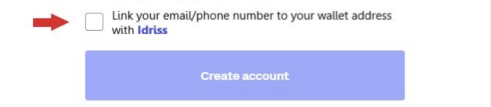
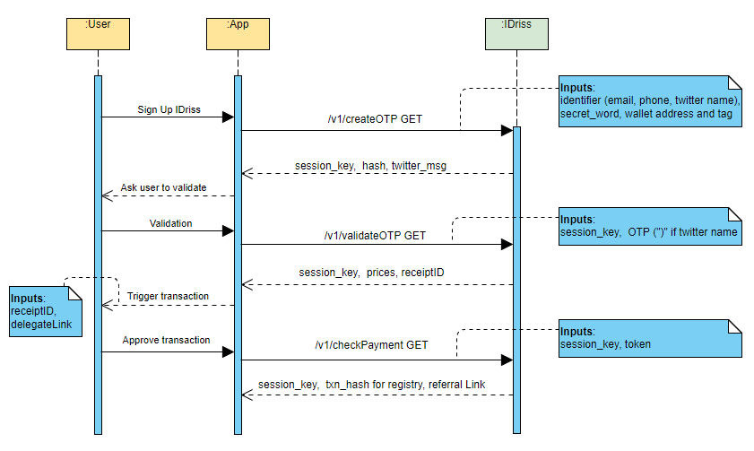

# Integrate IDriss Into Your Project

This is a node.js and webpack library for integrating [IDriss](https://www.idriss.xyz/) into your project.

IDriss is a decentralized mapping of emails, phone numbers and Twitter usernames to cryptocurrency wallet addresses.

This library has 3 functions:
1. Resolving IDriss names
2. Reverse Resolving IDriss names
3. Registering IDriss names inside your app


## Sample Usage
From cli
```bash
npm install idriss-crypto
```

And in code

```javascript
//for nodejs
import {IdrissCrypto} from "idriss-crypto";
//or when using commonJS
const {IdrissCrypto} = require("idriss-crypto");

//for browser
import {IdrissCrypto} from "idriss-crypto/lib/browser";

const idriss = new IdrissCrypto();
const resultEmail = await idriss.resolve("hello@idriss.xyz");
console.log(resultEmail);
```

And output of this is:

```javascript
{
    'Coinbase BTC': 'bc1qsvz5jumwew8haj4czxpzxujqz8z6xq4nxxh7vh',
    'Metamask ETH': '0x11E9F9344A9720d2B2B5F0753225bb805161139B'
}
```

The same is possible with Twitter handles:

```javascript
    const resultTwitter = await idriss.resolve("@idriss_xyz");
    console.log(resultTwitter);
```
resolves to: 
```javascript
{
    'Metamask ETH': '0x5ABca791C22E7f99237fCC04639E094Ffa0cCce9',
    'Coinbase ETH': '0x995945Fb74e0f8e345b3f35472c3e07202Eb38Ac',
    'Argent ETH': '0x4B994A4b85378906B3FE9C5292C749f79c9aD661',
    'Tally ETH': '0xa1ce10d433bb841cefd82a43f10b6b597538fa1d',
    'Trust ETH': '0xE297b1E893e7F8849413D8ee7407DB343979A449',
    'Rainbow ETH': '0xe10A2331Ac5498e7544579167755d6a756786a9F'
}
```

And phone numbers:

```javascript
    const resultPhone = await idriss.resolve("+16506655942");
    console.log(resultPhone);
```
resolves to: 
```javascript
{
    'Binance BTC': '1FdqxZsS6HVEs1NaQUdkoQWKYA9R9yfhdz',
    'Essentials ELA': 'EL4bLnZALyJKkoEf99qjZMrKVresHU76JU',
    'Phantom SOL': '6GmzRK2qLhBPK2WwYM14EGnxh95jBTsJGXMgFyM3VeVk'
}
```
# Functions
## I. Resolving IDriss names - class IdrissCrypto

#### constructor
```typescript
type ResolveOptions = {
  coin?: string|null,
  network?: string|null,
}

constructor(polygonEndpoint: string = "https://polygon-rpc.com/")
```
Params:
* polygonEndpoint (string) - uri to connect with blockchain. Default is empty https://polygon-rpc.com/.

#### resolve
```typescript
public async resolve(input: string, options:ResolveOptions = {}): Promise<{ [index: string]: string }>
```
Converts input string (e-mail address, phone number or Twitter handle) to wallets addresses. This method connects to IDriss API server and then to endpoint defined in constructor.

Params:
* input (string) - e-mail address, phone number (starting with (+) country code) or Twitter handle (starting with "@") together with optional secret word
* options (ResolveOptions object) - optional parameters
    * coin (string) - for example "ETH"
        * currently supported coins: ETH, BNB, USDT, USDC, ELA, MATIC, BTC, SOL and one ERC20 wildcard
    * network (string) - for example "evm"
        * currently supported network types: evm (for evm compatible addresses across different networks), btc and sol
    * currently, we support the following combinations:
        * network: evm
            * coin: ETH, BNB, USDT, USDC, ELA, MATIC, ERC20
        * network: btc
            * coin: BTC, ELA
        * network: sol
            * coin: SOL
* supported networks and coins will be updated on a regular basis. Any  wishes regarding supported combinations? Please join our [Discord](https://discord.gg/RJhJKamjw5) and let us know.

Returns:
Promise, that resolves to dictionary (object), in which keys are names addresses, and values are these addresses (see example). In case nothing was found, promise will resolve to empty object. If unknown network or coin (or combination) was provided, error returns. Example: "message": "Network not found."

## II. Reverse Resolving IDriss Names (coming soon)


## III. Registering IDriss Names Inside Your App - Class Authorization

### Sign up new users with IDriss using this class. 


<p align="center">

</p>
Example signup functionality in any application. The workflow should follow this procedure:
<br />
<br />
<p align="center">

</p>

#### CreateOTP

```typescript
 public static async CreateOTP(tag:string, identifier:string, address:string, secretWord:string | null = null):Promise<CreateOTPResponse>
```

Params:

* tag (string) - identifier for wallet. See below for options. Contact us on [Discord](https://discord.gg/RJhJKamjw5) to add additional tags.
* identifier (string) - email, phone number with country code or @twitter handle (including "@")
* address (string) - address to be linked with identifier+secret_word
* secretWord(string, optional) - to be appended to identifier when using the resolver


returns:

```typescript
 class CreateOTPResponse {
    public sessionKey: string;
    public triesLeft: number;
}
```

example:

```typescript
import {Authorization} from "idriss-crypto";

const result = await Authorization.CreateOTP("Metamask ETH", "hello@idriss.xyz", "0x11E9F9344A9720d2B2B5F0753225bb805161139B")
console.log(result.sessionKey)
```


available tags:

* "Metamask ETH", "Binance ETH", "Coinbase ETH", "Exchange ETH", "Private ETH", "Essentials ETH", "Rainbow ETH", "Argent ETH", "Tally ETH", "Trust ETH", "Public ETH",
* "Essentials BTC", "Binance BTC", "Coinbase BTC", "Exchange BTC", "Private BTC",
* "Metamask USDT", "Binance USDT", "Coinbase USDT", "Exchange USDT", "Private USDT", "Essentials USDT", 
* "Metamask USDC", "Binance USDC", "Coinbase USDC", "Exchange USDC", "Private USDC", "Essentials USDC", 
* "Solana SOL", "Coinbase SOL", "Trust SOL", "Binance SOL", "Phantom SOL",
* "Metamask BNB", "Essentials BNB", 
* "Essentials ELA SC", "Essentials ELA" (Smart Chain and native ELA network)
* "Essentials MATIC",  
* "ERC20"

tags must match address type, error thrown otherwise.

#### ValidateOTP

```typescript
static async ValidateOTP(OTP:string, sessionKey:string):Promise<ValidateOTPResponse>
```

Validates if OTP is correct. If OTP is wrong, WrongOTPException is thrown. If correct, link will be saved on the blockchain and txn_hash is returned. Once the transaction went through, link can be found with resolver.

Params:
* OTP (string) - 6-digit number
* sessionKey (string) - session key provided in first call 

Returns:

```typescript
export class ValidateOTPResponse {
    public message: string;
    public txnHash: string;
}
```

Example:

```typescript

import {Authorization, WrongOTPException} from "idriss-crypto";

try {
    await Authorization.ValidateOTP("123456", "QNmxmWdWVZ3pm1rHEN7G");
    console.log("Validated succesfully");
} catch (ex) {
    if (ex instanceof WrongOTPException) {
        console.log("OTP is wrong");
    } else {
        console.log("Other error");
    }
}
```
Error is thrown if session is not valid anymore (more than 3 wrong OTPs), wrong OTP is provided, the transaction failed or the session key is unknown.